

  

  

### `~/currently-building`

- **ProjectYCJobs**: agentic job research and matching on FastAPI, React, Postgres and Redis Streams.
- **LLM evaluation**: evaluators and adapters around OpenEvals.

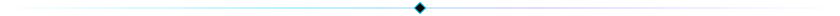

### `~/selected-systems`

  

  

  

### `~/open-source-and-research`

  
  

### `~/stack`

  

### `~/signals`

  
  

<!-- 

  

 -->

<!-- Cards under <code>assets/generated/</code> are rebuilt daily by <code>.github/workflows/profile-refresh.yml</code>. -->
